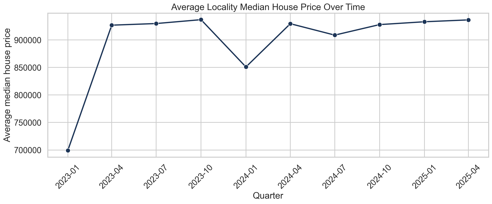
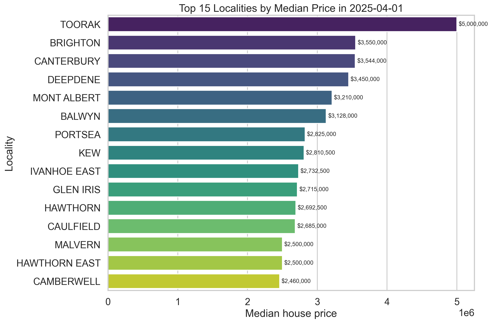
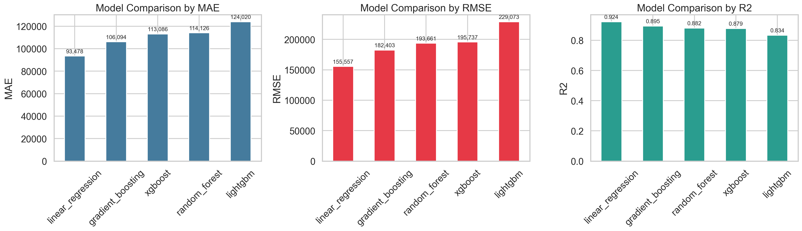
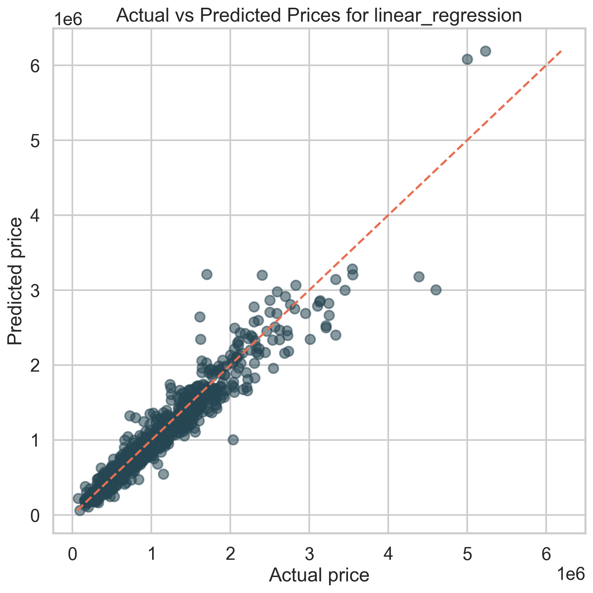

# Melbourne Housing Price Predictor

Forecasting quarterly median house prices across Melbourne localities using the Victorian Property Sales Report (VPSR), with a full notebook workflow, visual storytelling, model benchmarking, and a deployable FastAPI service.

## Project Snapshot

- Data source: Victorian Property Sales Report (`.xls`)
- Forecast target: quarterly median house price
- Coverage: `777` Melbourne localities
- Best model: `LinearRegression`
- Latest benchmark: `MAE = 93,477.93`, `RMSE = 155,557.10`, `R2 = 0.9236`
- Deployment: `FastAPI + Uvicorn`

## Why This Project

The goal of this project is to turn irregular government-style housing spreadsheets into a reproducible machine learning workflow that is easy to explain, easy to extend, and practical to deploy.

This repository includes:

- a self-contained Jupyter Notebook for cleaning, analysis, feature engineering, training, and conclusions
- exported plots for GitHub-friendly presentation
- trained artifacts for direct inference
- a FastAPI app for local or cloud deployment

## Visual Highlights

### Market Trend



### Most Expensive Localities in the Latest Quarter



### Model Benchmark Comparison



### Actual vs Predicted Prices



## Key Findings

- Melbourne house prices vary substantially across localities, with clear high-end and mid-market segmentation.
- Lag-based historical price features are strong predictors for short-term quarterly forecasting.
- In this dataset, a simple linear model outperformed more complex tree-based methods.
- The current workflow is strong enough for a portfolio project, a teaching example, or a lightweight prototype API.

## Repository Structure

```text
.
|-- app.py
|-- assets/
|   |-- actual_vs_predicted.png
|   |-- latest_top_localities.png
|   |-- locality_trends.png
|   |-- market_trend.png
|   |-- model_comparison.png
|   |-- observation_coverage.png
|   `-- price_distribution.png
|-- artifacts/
|   |-- best_model.joblib
|   |-- clean_long_data.csv
|   |-- latest_history.csv
|   `-- metrics.json
|-- dataset/
|-- notebooks/
|   `-- melbourne_housing_model.ipynb
|-- .gitignore
|-- README.md
`-- requirements.txt
```

## Main Notebook

The full workflow lives in [notebooks/melbourne_housing_model.ipynb](/E:/!Projects/Python/Melbourne Housing Price Predictor/notebooks/melbourne_housing_model.ipynb).

The notebook has already been executed and saved with outputs, so GitHub can render:

- tables
- charts
- benchmark results
- final conclusions

The notebook covers:

1. raw VPSR data cleaning
2. exploratory data analysis
3. feature engineering
4. model benchmarking
5. artifact export
6. prediction helper design
7. deployment-oriented API logic
8. final interpretation and limitations

## Model Benchmark

| Model | MAE | RMSE | R2 |
|---|---:|---:|---:|
| LinearRegression | 93,477.93 | 155,557.10 | 0.9236 |
| GradientBoosting | 106,093.60 | 182,402.66 | 0.8950 |
| RandomForest | 114,125.85 | 193,661.20 | 0.8816 |
| XGBoost | 113,086.41 | 195,737.24 | 0.8790 |
| LightGBM | 124,020.14 | 229,072.94 | 0.8343 |

## Installation

Install the dependencies:

```bash
pip install -r requirements.txt
```

## Run the Notebook

Start Jupyter:

```bash
jupyter notebook
```

Then open:

```text
notebooks/melbourne_housing_model.ipynb
```

## FastAPI Deployment

This repository includes a deployable FastAPI app in [app.py](/E:/!Projects/Python/Melbourne Housing Price Predictor/app.py).

Start the API locally:

```bash
uvicorn app:app --host 0.0.0.0 --port 8000
```

Open the automatic API docs:

```text
http://127.0.0.1:8000/docs
```

Available endpoints:

- `GET /health`
- `POST /predict`

Example request:

```bash
curl -X POST "http://127.0.0.1:8000/predict" ^
  -H "Content-Type: application/json" ^
  -d "{\"locality\":\"ABBOTSFORD\",\"year\":2026,\"quarter\":2}"
```

Example response:

```json
{
  "locality": "ABBOTSFORD",
  "year": 2026,
  "quarter": 2,
  "predicted_median_price": 1260616.82,
  "used_history_defaults": true
}
```

## Generated Artifacts

Running the notebook produces:

- `artifacts/clean_long_data.csv`
- `artifacts/best_model.joblib`
- `artifacts/latest_history.csv`
- `artifacts/metrics.json`

These files are used both for analysis and for API inference.

## Visual Design Notes

- All bar charts in the notebook include explicit numeric labels.
- Key figures are exported to `assets/` so the README can display them directly.
- The notebook is written with English code comments to improve readability for GitHub visitors.

## Limitations

- The current feature set is focused on locality identity and historical price lags.
- The model does not yet include macroeconomic indicators, geospatial features, or property-level detail.
- The historical time span is still relatively short for a full long-horizon forecasting study.

## Next Steps

1. Add external features such as interest rates, distance to CBD, or demographic indicators.
2. Introduce walk-forward validation for deeper time-series evaluation.
3. Package the FastAPI service for cloud deployment on Render, Railway, or Azure.
4. Add a small frontend dashboard for interactive suburb prediction.
